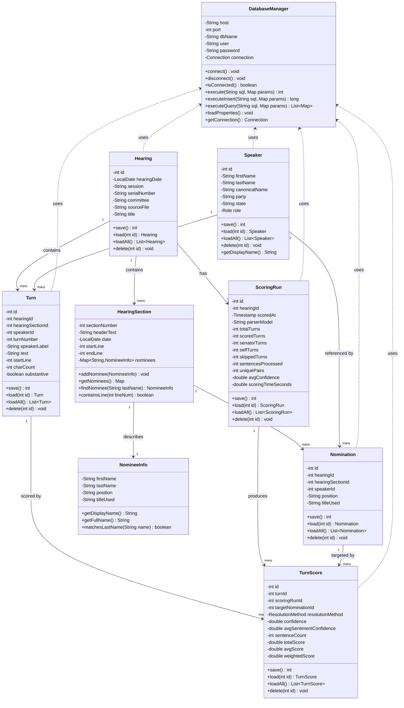

# UML: Database Entity Classes

```mermaid
classDiagram
    class DatabaseManager {
        -String host
        -int port
        -String dbName
        -String user
        -String password
        -Connection connection
        +connect() void
        +disconnect() void
        +isConnected() boolean
        +execute(String sql, Map params) int
        +executeInsert(String sql, Map params) long
        +executeQuery(String sql, Map params) List~Map~
        +loadProperties() void
        +getConnection() Connection
    }

    class Hearing {
        -int id
        -LocalDate hearingDate
        -String session
        -String serialNumber
        -String committee
        -String sourceFile
        -String title
        +save() int
        +load(int id) Hearing
        +loadAll() List~Hearing~
        +delete(int id) void
    }

    class Speaker {
        -int id
        -String firstName
        -String lastName
        -String canonicalName
        -String party
        -String state
        -Role role
        +save() int
        +load(int id) Speaker
        +loadAll() List~Speaker~
        +delete(int id) void
        +getDisplayName() String
    }

    class HearingSection {
        -int sectionNumber
        -String headerText
        -LocalDate date
        -int startLine
        -int endLine
        -Map~String,NomineeInfo~ nominees
        +addNominee(NomineeInfo) void
        +getNominees() Map
        +findNominee(String lastName) NomineeInfo
        +containsLine(int lineNum) boolean
    }

    class Nomination {
        -int id
        -int hearingId
        -int hearingSectionId
        -int speakerId
        -String position
        -String titleUsed
        +save() int
        +load(int id) Nomination
        +loadAll() List~Nomination~
        +delete(int id) void
    }

    class Turn {
        -int id
        -int hearingId
        -int hearingSectionId
        -int speakerId
        -int turnNumber
        -String speakerLabel
        -String text
        -int startLine
        -int charCount
        -boolean substantive
        +save() int
        +load(int id) Turn
        +loadAll() List~Turn~
        +delete(int id) void
    }

    class ScoringRun {
        -int id
        -int hearingId
        -Timestamp scoredAt
        -String parserModel
        -int totalTurns
        -int scoredTurns
        -int senatorTurns
        -int selfTurns
        -int skippedTurns
        -int sentencesProcessed
        -int uniquePairs
        -double avgConfidence
        -double scoringTimeSeconds
        +save() int
        +load(int id) ScoringRun
        +loadAll() List~ScoringRun~
        +delete(int id) void
    }

    class TurnScore {
        -int id
        -int turnId
        -int scoringRunId
        -int targetNominationId
        -ResolutionMethod resolutionMethod
        -double confidence
        -double avgSentimentConfidence
        -int sentenceCount
        -double totalScore
        -double avgScore
        -double weightedScore
        +save() int
        +load(int id) TurnScore
        +loadAll() List~TurnScore~
        +delete(int id) void
    }

    class NomineeInfo {
        -String firstName
        -String lastName
        -String position
        -String titleUsed
        +getDisplayName() String
        +getFullName() String
        +matchesLastName(String name) boolean
    }

    Hearing "1" --> "many" HearingSection : contains
    Hearing "1" --> "many" Turn : contains
    Hearing "1" --> "many" ScoringRun : has
    HearingSection "1" --> "many" Nomination : has
    HearingSection "1" --> "1" NomineeInfo : describes
    Speaker "1" --> "many" Nomination : referenced by
    Speaker "1" --> "many" Turn : speaks
    Turn "1" --> "many" TurnScore : scored by
    ScoringRun "1" --> "many" TurnScore : produces
    Nomination "1" --> "many" TurnScore : targeted by
    DatabaseManager <.. Hearing : uses
    DatabaseManager <.. Speaker : uses
    DatabaseManager <.. Nomination : uses
    DatabaseManager <.. Turn : uses
    DatabaseManager <.. ScoringRun : uses
    DatabaseManager <.. TurnScore : uses
```
