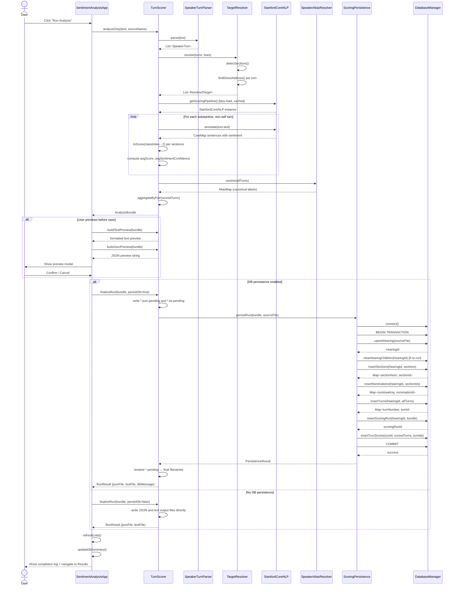

# UML: Analysis Pipeline Sequence Diagram

```mermaid
sequenceDiagram
    actor User
    participant GUI as SentimentAnalysisApp
    participant TS as TurnScorer
    participant STP as SpeakerTurnParser
    participant TR as TargetResolver
    participant NLP as StanfordCoreNLP
    participant SAR as SpeakerAliasResolver
    participant SP as ScoringPersistence
    participant DB as DatabaseManager

    User->>GUI: Click "Run Analysis"
    GUI->>TS: analyzeOnly(text, sourceName)

    TS->>STP: parse(text)
    STP-->>TS: List~SpeakerTurn~

    TS->>TR: resolve(turns, lines)
    TR->>TR: detectSections()
    TR->>TR: findDirectAddress() per turn
    TR-->>TS: List~ResolvedTarget~

    TS->>NLP: getScoringPipeline() [lazy-load, cached]
    NLP-->>TS: StanfordCoreNLP instance

    loop For each substantive, non-self turn
        TS->>NLP: annotate(turn.text)
        NLP-->>TS: CoreMap sentences with sentiment
        TS->>TS: toScore(classIndex - 2) per sentence
        TS->>TS: compute avgScore, avgSentimentConfidence
    end

    TS->>SAR: resolve(allTurns)
    SAR-->>TS: AliasMap (canonical labels)

    TS->>TS: aggregateByPair(scoredTurns)
    TS-->>GUI: AnalysisBundle

    alt User previews before save
        GUI->>TS: buildTextPreview(bundle)
        TS-->>GUI: formatted text preview
        GUI->>TS: buildJsonPreview(bundle)
        TS-->>GUI: JSON preview string
        GUI->>User: Show preview modal
        User->>GUI: Confirm / Cancel
    end

    alt DB persistence enabled
        GUI->>TS: finalizeRun(bundle, persistDb=true)
        TS->>TS: write *.json.pending and *.txt.pending

        TS->>SP: persistRun(bundle, sourceFile)
        SP->>DB: connect()
        SP->>DB: BEGIN TRANSACTION

        SP->>DB: upsertHearing(sourceFile)
        DB-->>SP: hearingId

        SP->>DB: clearHearingChildren(hearingId) [if re-run]
        SP->>DB: insertSections(hearingId, sections)
        DB-->>SP: Map~sectionNum, sectionId~

        SP->>DB: insertNominations(hearingId, sectionIds)
        DB-->>SP: Map~nomineeKey, nominationId~

        SP->>DB: insertTurns(hearingId, allTurns)
        DB-->>SP: Map~turnNumber, turnId~

        SP->>DB: insertScoringRun(hearingId, bundle)
        DB-->>SP: scoringRunId

        SP->>DB: insertTurnScores(runId, scoredTurns, turnIds)
        SP->>DB: COMMIT
        DB-->>SP: success
        SP-->>TS: PersistenceResult

        TS->>TS: rename *.pending → final filenames
        TS-->>GUI: RunResult (jsonFile, textFile, dbMessage)
    else No DB persistence
        GUI->>TS: finalizeRun(bundle, persistDb=false)
        TS->>TS: write JSON and text output files directly
        TS-->>GUI: RunResult (jsonFile, textFile)
    end

    GUI->>GUI: refreshLists()
    GUI->>GUI: updateDbSummary()
    GUI-->>User: Show completion log + navigate to Results
```
