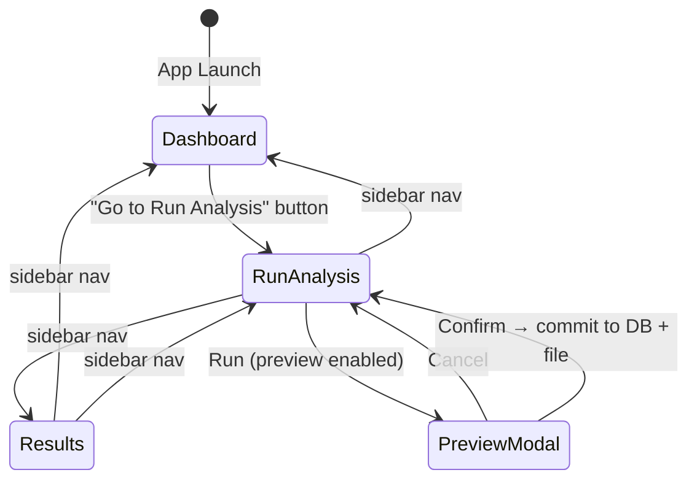

# UML: GUI Application Class Diagram

```mermaid
classDiagram
    class Main {
        +main(String[] args)$
    }

    class SentimentAnalysisApp {
        -JFrame appFrame
        -CardLayout contentCards
        -JPanel contentPanel
        -DefaultListModel~String~ inputListModel
        -DefaultListModel~String~ outputListModel
        -JList~String~ inputList
        -JList~String~ outputList
        -JTextArea logArea
        -JLabel dbStatusValue
        -JLabel dbHearingValue
        -JLabel dbRunValue
        -JLabel dbTurnsValue
        -JLabel dbScoresValue
        -JLabel dbReplaceValue
        -JSpinner batchWorkersSpinner
        -JCheckBox dbPersistCheckBox
        -JCheckBox previewBeforeCommitCheckBox
        -JButton runSingleButton
        -JButton runBatchButton
        +launch()$
        +showUI()
        -buildNavSidebar() JPanel
        -buildHomePage() JPanel
        -buildRunAnalysisPage() JPanel
        -buildResultsPage() JPanel
        -runSingleAnalysis()
        -runBatchAnalysis()
        -commitAnalysisResult(AnalysisBundle bundle, File inputFile)
        -showPreviewAndConfirm(AnalysisBundle bundle, File inputFile) boolean
        -refreshLists()
        -loadFiles(DefaultListModel model, File dir, String ext)
        -refreshRecentOutputs()
        -updateDbSummary(PersistenceResult result)
        -clearDbSummary()
    }

    class FileNameRenderer {
        +getListCellRendererComponent(...) Component
    }

    class RunOutcome {
        +File inputFile
        +TurnScorer.RunResult result
        +Exception error
    }

    class Dashboard {
        <<screen>>
        +Recent Outputs panel
        +Last Run DB Summary panel
        +Go to Run Analysis button
    }

    class RunAnalysisScreen {
        <<screen>>
        +Input file list (Add/Remove/SelectAll/Clear)
        +Run options (DB persist, Preview, Workers)
        +Run Single / Run Batch buttons
        +Activity log text area
    }

    class ResultsScreen {
        <<screen>>
        +Output file list (Remove/Refresh)
        +File content viewer (txt or json)
    }

    Main --> SentimentAnalysisApp : launches
    SentimentAnalysisApp +-- FileNameRenderer : inner class
    SentimentAnalysisApp +-- RunOutcome : inner class
    SentimentAnalysisApp --> Dashboard : navigates to
    SentimentAnalysisApp --> RunAnalysisScreen : navigates to
    SentimentAnalysisApp --> ResultsScreen : navigates to
    SentimentAnalysisApp --> TurnScorer : delegates analysis
```

## Navigation Flow


